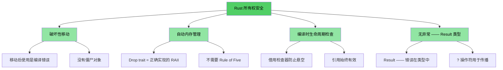
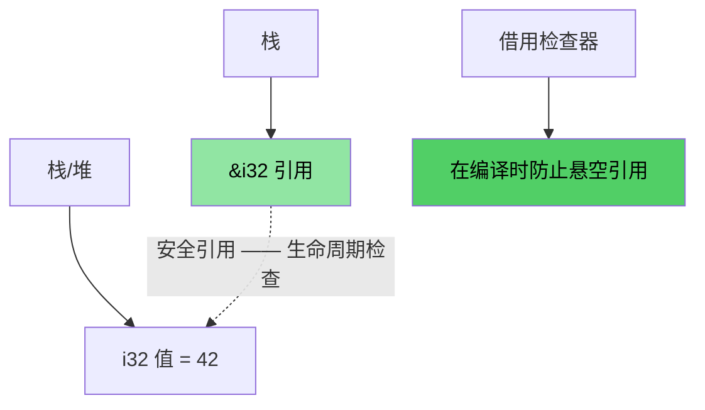
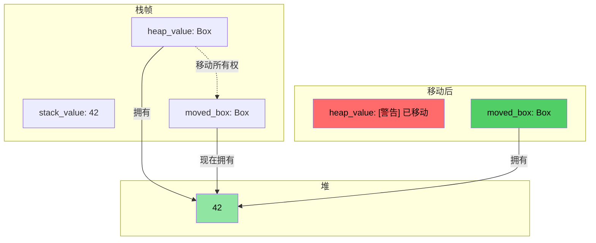
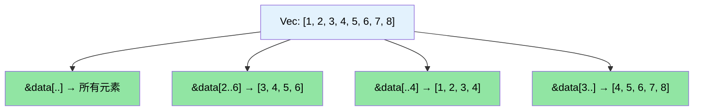

# 讲师介绍与一般方法

> **你将学到什么：** 课程结构、互动形式，以及熟悉的 C/C++ 概念如何映射到 Rust 等价物。本章设定预期并为你提供本书的路线图。

- 讲师介绍
    - 微软 SCHIE（硅片与云硬件基础设施工程）团队的首席固件架构师
    - 行业资深专家，拥有安全、系统编程（固件、操作系统、虚拟机监控程序）、CPU 和平台架构以及 C++ 系统方面的专业知识
    - 自 2017 年（在 AWS EC2）开始用 Rust 编程，从此爱上了这门语言
- 本课程旨在尽可能互动
    - 假设：你了解 C、C++ 或两者
    - 示例经过精心设计，将熟悉的概念映射到 Rust 等价物
    - **请随时提出澄清问题**
- 讲师期待与团队保持持续交流

# 为什么选择 Rust
> **想直接看代码？** 跳转到 [给我看代码](ch02-getting-started.md#够了给我看代码)

无论你来自 C 还是 C++，核心痛点都是一样的：内存安全 bug 能干净地编译，但在运行时崩溃、损坏或泄漏。

- 超过 **70% 的 CVE** 是由内存安全问题引起的 —— 缓冲区溢出、悬空指针、释放后使用
- C++ 的 `shared_ptr`、`unique_ptr`、RAII 和移动语义是朝正确方向迈出的一步，但它们是 **创可贴，不是治愈** —— 它们留下了 use-after-move、引用循环、迭代器失效和异常安全的漏洞
- Rust 提供你依赖的 C/C++ 性能，但具有安全性的 **编译时保证**

> **📖 深度解析：** 参见 [为什么 C/C++ 开发者需要 Rust](ch01-1-why-c-cpp-developers-need-rust.md) 了解具体漏洞示例、Rust 消除的完整列表，以及为什么 C++ 智能指针不够用

----

# Rust 如何解决这些问题？

## 缓冲区溢出和边界违规
- 所有 Rust 数组、切片和字符串都有明确的边界。编译器插入检查以确保任何边界违规导致 **运行时崩溃**（Rust 术语中的 panic）—— 而不是未定义行为

## 悬空指针和引用
- Rust 引入生命周期和借用检查以在 **编译时** 消除悬空引用
- 没有悬空指针，没有释放后使用 —— 编译器根本不允许

## Use-after-move
- Rust 的所有权系统使移动具有 **破坏性** —— 一旦移动一个值，编译器就 **拒绝** 让你使用原始值。没有僵尸对象，没有"有效但未指定状态"

## 资源管理
- Rust 的 `Drop` trait 是正确实现的 RAII —— 编译器在超出作用域时自动释放资源，并 **防止 use-after-move**，而 C++ RAII 做不到
- 不需要 Rule of Five（不需要定义拷贝构造、移动构造、拷贝赋值、移动赋值、析构函数）

## 错误处理
- Rust 没有异常。所有错误都是值（`Result<T, E>`），使错误处理显式并在类型签名中可见

## 迭代器失效
- Rust 的借用检查器 **禁止在迭代集合时修改它**。你根本不能写出困扰 C++ 代码库的 bug：
```rust
// Rust 中等价的 erase-during-iteration：retain()
pending_faults.retain(|f| f.id != fault_to_remove.id);

// 或者：收集到新 Vec（函数式风格）
let remaining: Vec<_> = pending_faults
    .into_iter()
    .filter(|f| f.id != fault_to_remove.id)
    .collect();
```

## 数据竞争
- 类型系统通过 `Send` 和 `Sync` trait 在 **编译时** 防止数据竞争

## 内存安全可视化

### Rust 所有权 —— 安全设计

```rust
fn safe_rust_ownership() {
    // 移动是破坏性的：原始值消失了
    let data = vec![1, 2, 3];
    let data2 = data;           // 发生移动
    // data.len();              // 编译错误：移动后使用值
    
    // 借用：安全的共享访问
    let owned = String::from("Hello, World!");
    let slice: &str = &owned;  // 借用 —— 无分配
    println!("{}", slice);     // 始终安全
    
    // 不可能有悬空引用
    /*
    let dangling_ref;
    {
        let temp = String::from("temporary");
        dangling_ref = &temp;  // 编译错误：temp 存活时间不够长
    }
    */
}
```



## 内存布局：Rust 引用



### `Box<T>` 堆分配可视化

```rust
fn box_allocation_example() {
    // 栈分配
    let stack_value = 42;
    
    // 使用 Box 进行堆分配
    let heap_value = Box::new(42);
    
    // 移动所有权
    let moved_box = heap_value;
    // heap_value 不再可访问
}
```



## 切片操作可视化

```rust
fn slice_operations() {
    let data = vec![1, 2, 3, 4, 5, 6, 7, 8];
    
    let full_slice = &data[..];        // [1,2,3,4,5,6,7,8]
    let partial_slice = &data[2..6];   // [3,4,5,6]
    let from_start = &data[..4];       // [1,2,3,4]
    let to_end = &data[3..];           // [4,5,6,7,8]
}
```



# Rust 的其他独特卖点和特性
- 线程之间没有数据竞争（编译时 `Send`/`Sync` 检查）
- 没有 use-after-move（不像 C++ `std::move` 会留下僵尸对象）
- 没有未初始化的变量
    - 所有变量必须在使用前初始化
- 没有简单的内存泄漏
    - `Drop` trait = 正确实现的 RAII，不需要 Rule of Five
    - 编译器在超出作用域时自动释放内存
- 没有忘记解锁的互斥锁
    - 锁守卫是访问数据的 *唯一* 方式（`Mutex<T>` 包装数据，而不是访问）
- 没有异常处理的复杂性
    - 错误是值（`Result<T, E>`），在函数签名中可见，用 `?` 传播
- 对类型推导、枚举、模式匹配、零成本抽象的优秀支持
- 内置依赖管理、构建、测试、格式化、linting 支持
    - `cargo` 替代 make/CMake + lint + 测试框架

# 快速参考：Rust vs C/C++

| **概念** | **C** | **C++** | **Rust** | **关键区别** |
|-------------|-------|---------|----------|-------------------|
| 内存管理 | `malloc()/free()` | `unique_ptr`, `shared_ptr` | `Box<T>`, `Rc<T>`, `Arc<T>` | 自动，无循环 |
| 数组 | `int arr[10]` | `std::vector<T>`, `std::array<T>` | `Vec<T>`, `[T; N]` | 默认边界检查 |
| 字符串 | `char*` 带 `\0` | `std::string`, `string_view` | `String`, `&str` | 保证 UTF-8，生命周期检查 |
| 引用 | `int* ptr` | `T&`, `T&&` (移动) | `&T`, `&mut T` | 借用检查，生命周期 |
| 多态 | 函数指针 | 虚函数、继承 | Trait、trait 对象 | 组合优于继承 |
| 泛型编程 | 宏 (`void*`) | 模板 | 泛型 + trait bounds | 更好的错误信息 |
| 错误处理 | 返回码，`errno` | 异常，`std::optional` | `Result<T, E>`, `Option<T>` | 无隐藏控制流 |
| NULL/空安全 | `ptr == NULL` | `nullptr`, `std::optional<T>` | `Option<T>` | 强制空检查 |
| 线程安全 | 手动 (pthreads) | 手动同步 | 编译时保证 | 数据竞争不可能 |
| 构建系统 | Make, CMake | CMake, Make 等 | Cargo | 集成工具链 |
| 未定义行为 | 运行时崩溃 | 微妙的 UB（有符号溢出、别名） | 编译时错误 | 安全保证 |
