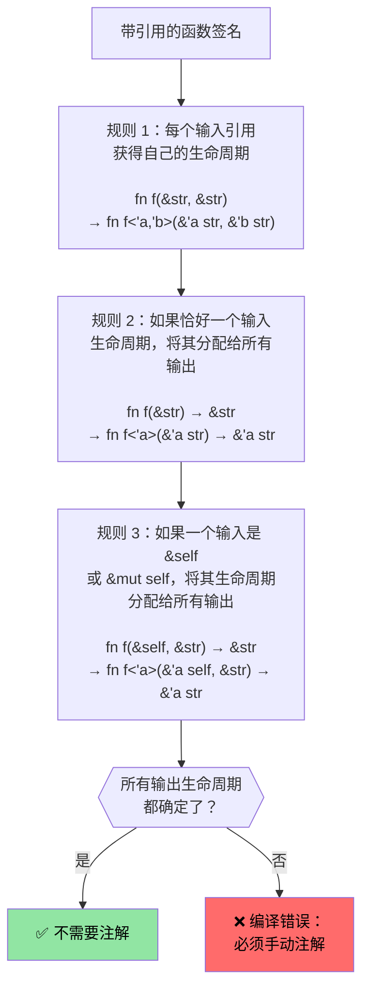

# Rust 生命周期与借用

> **你将学到什么：** Rust 的生命周期系统如何确保引用永远不会悬空 —— 从隐式生命周期到显式注解，再到使大多数代码无需注解的三条省略规则。在进入下一节智能指针之前，先在这里理解生命周期至关重要。

- Rust 强制执行单一可变引用和任意数量的不可变引用
    - 任何引用的生命周期必须至少与原始拥有生命周期一样长。这些是隐式生命周期，由编译器推断（参见 https://doc.rust-lang.org/nomicon/lifetime-elision.html）
```rust
fn borrow_mut(x: &mut u32) {
    *x = 43;
}
fn main() {
    let mut x = 42;
    let y = &mut x;
    borrow_mut(y);
    let _z = &x; // 允许，因为编译器知道 y 随后不会被使用
    //println!("{y}"); // 如果取消注释这行，则不会编译
    borrow_mut(&mut x); // 允许，因为 _z 没有被使用
    let z = &x; // 正常 —— 在 borrow_mut() 返回后可变借用 x 结束
    println!("{z}");
}
```

# Rust 生命周期注解
- 处理多个生命周期时需要显式生命周期注解
    - 生命周期用 `'` 表示，可以是任何标识符（`'a`、`'b`、`'static` 等）
    - 当编译器无法确定引用应该存活多长时间时，它需要帮助
- **常见场景**：函数返回引用，但它来自哪个输入？
```rust
#[derive(Debug)]
struct Point {x: u32, y: u32}

// 没有生命周期注解，这不会编译：
// fn left_or_right(pick_left: bool, left: &Point, right: &Point) -> &Point

// 使用生命周期注解 —— 所有引用共享相同的生命周期 'a
fn left_or_right<'a>(pick_left: bool, left: &'a Point, right: &'a Point) -> &'a Point {
    if pick_left { left } else { right }
}

// 更复杂：输入的不同生命周期
fn get_x_coordinate<'a, 'b>(p1: &'a Point, _p2: &'b Point) -> &'a u32 {
    &p1.x  // 返回值生命周期与 p1 绑定，而不是 p2
}

fn main() {
    let p1 = Point {x: 20, y: 30};
    let result;
    {
        let p2 = Point {x: 42, y: 50};
        result = left_or_right(true, &p1, &p2);
        // 这有效，因为我们在 p2 离开作用域之前使用 result
        println!("Selected: {result:?}");
    }
    // 这不会工作 —— result 引用 p2，而 p2 已经消失：
    // println!("After scope: {result:?}");
}
```

# Rust 生命周期注解
- 数据结构中的引用也需要生命周期注解
```rust
use std::collections::HashMap;
#[derive(Debug)]
struct Point {x: u32, y: u32}
struct Lookup<'a> {
    map: HashMap<u32, &'a Point>,
}
fn main() {
    let p = Point{x: 42, y: 42};
    let p1 = Point{x: 50, y: 60};
    let mut m = Lookup {map : HashMap::new()};
    m.map.insert(0, &p);
    m.map.insert(1, &p1);
    {
        let p3 = Point{x: 60, y:70};
        //m.map.insert(3, &p3); // 不会编译
        // p3 在这里被 drop，但 m 将存活更久
    }
    for (k, v) in m.map {
        println!("{v:?}");
    }
    // m 在这里被 drop
    // p1 和 p 按这个顺序在这里被 drop
} 
```

# 练习：带生命周期的第一个单词

🟢 **入门** —— 实践生命周期省略

写一个函数 `fn first_word(s: &str) -> &str`，返回字符串中第一个空格分隔的单词。想想为什么这在没有显式生命周期注解的情况下可以编译（提示：省略规则 #1 和 #2）。

<details><summary>解答（点击展开）</summary>

```rust
fn first_word(s: &str) -> &str {
    // 编译器应用省略规则：
    // 规则 1：输入 &str 获得生命周期 'a → fn first_word(s: &'a str) -> &str
    // 规则 2：单一输入生命周期 → 输出获得相同生命周期 → fn first_word(s: &'a str) -> &'a str
    match s.find(' ') {
        Some(pos) => &s[..pos],
        None => s,
    }
}

fn main() {
    let text = "hello world foo";
    let word = first_word(text);
    println!("First word: {word}");  // "hello"
    
    let single = "onlyone";
    println!("First word: {}", first_word(single));  // "onlyone"
}
```

</details>

# 练习：带生命周期的切片存储

🟡 **中级** —— 你第一次遇到生命周期注解
- 创建一个存储 `\u0026str` 切片引用的结构
    - 创建一个长的 `\u0026str` 并在结构内部存储来自它的切片引用
    - 写一个接受结构并返回包含切片的函数
```rust
// TODO: 创建一个存储切片引用的结构
struct SliceStore {

}
fn main() {
    let s = "This is long string";
    let s1 = &s[0..];
    let s2 = &s[1..2];
    // let slice = struct SliceStore {...};
    // let slice2 = struct SliceStore {...};
}
```

<details><summary>解答（点击展开）</summary>

```rust
struct SliceStore<'a> {
    slice: &'a str,
}

impl<'a> SliceStore<'a> {
    fn new(slice: &'a str) -> Self {
        SliceStore { slice }
    }

    fn get_slice(&self) -> &'a str {
        self.slice
    }
}

fn main() {
    let s = "This is a long string";
    let store1 = SliceStore::new(&s[0..4]);   // "This"
    let store2 = SliceStore::new(&s[5..7]);   // "is"
    println!("store1: {}", store1.get_slice());
    println!("store2: {}", store2.get_slice());
}
// 输出：
// store1: This
// store2: is
```

</details>

---

## 生命周期省略规则深度解析

C 程序员经常问："如果生命周期这么重要，为什么大多数 Rust 函数没有 `'a` 注解？"答案是 **生命周期省略** —— 编译器自动应用三条确定性规则来推断生命周期。

### 三条省略规则

Rust 编译器按 **顺序** 将这些规则应用于函数签名。如果应用规则后所有输出生命周期都被确定，则不需要注解。



### 逐规则示例

**规则 1** —— 每个输入引用获得自己的生命周期参数：
```rust
// 你写的：
fn first_word(s: &str) -> &str { ... }

// 编译器在规则 1 后看到的：
fn first_word<'a>(s: &'a str) -> &str { ... }
// 只有一个输入生命周期 → 规则 2 适用
```

**规则 2** —— 单一输入生命周期传播到所有输出：
```rust
// 规则 2 后：
fn first_word<'a>(s: &'a str) -> &'a str { ... }
// ✅ 所有输出生命周期都确定了 —— 不需要注解！
```

**规则 3** —— `\u0026self` 生命周期传播到输出：
```rust
// 你写的：
impl SliceStore<'_> {
    fn get_slice(&self) -> &str { self.slice }
}

// 编译器在规则 1 + 3 后看到的：
impl SliceStore<'_> {
    fn get_slice<'a>(&'a self) -> &'a str { self.slice }
}
// ✅ 不需要注解 —— &self 生命周期用于输出
```

**当省略失败时** —— 你必须注解：
```rust
// 两个输入引用，没有 &self → 规则 2 和 3 不适用
// fn longest(a: &str, b: &str) -> &str  ← 不会编译

// 修复：告诉编译器输出从哪个输入借用
fn longest<'a>(a: &'a str, b: &'a str) -> &'a str {
    if a.len() >= b.len() { a } else { b }
}
```

### C 程序员的心理模型

在 C 中，每个指针都是独立的 —— 程序员在心理上跟踪每个指针引用哪个分配，编译器完全信任你。在 Rust 中，生命周期使这种跟踪 **显式且编译器可验证**：

| C | Rust | 发生了什么 |
|---|------|-------------|
| `char* get_name(struct User* u)` | `fn get_name(&self) -> &str` | 规则 3 省略：输出从 `self` 借用 |
| `char* concat(char* a, char* b)` | `fn concat<'a>(a: &'a str, b: &'a str) -> &'a str` | 必须注解 —— 两个输入 |
| `void process(char* in, char* out)` | `fn process(input: &str, output: &mut String)` | 没有输出引用 —— 不需要生命周期 |
| `char* buf; /* 谁拥有这个？ */` | 如果生命周期错误则编译错误 | 编译器捕获悬空指针 |

### `'static` 生命周期

`'static` 表示引用在 **整个程序持续期间** 有效。它是 C 全局变量或字符串字面量的 Rust 等效：

```rust
// 字符串字面量总是 'static —— 它们位于二进制文件的只读段
let s: &'static str = "hello";  // 等同于 C 中的：static const char* s = "hello";

// 常量也是 'static
static GREETING: &str = "hello";

// 在线程生成的 trait bounds 中常见：
fn spawn<F: FnOnce() + Send + 'static>(f: F) { /* ... */ }
// 这里的 'static 表示："闭包不能借用任何局部变量"
//（要么将它们移入，要么只使用 'static 数据）
```

### 练习：预测省略

🟡 **中级**

对于下面的每个函数签名，预测编译器是否能省略生命周期。
如果不能，添加必要的注解：

```rust
// 1. 编译器能省略吗？
fn trim_prefix(s: &str) -> &str { &s[1..] }

// 2. 编译器能省略吗？
fn pick(flag: bool, a: &str, b: &str) -> &str {
    if flag { a } else { b }
}

// 3. 编译器能省略吗？
struct Parser { data: String }
impl Parser {
    fn next_token(&self) -> &str { &self.data[..5] }
}

// 4. 编译器能省略吗？
fn split_at(s: &str, pos: usize) -> (&str, &str) {
    (&s[..pos], &s[pos..])
}
```

<details><summary>解答（点击展开）</summary>

```rust,ignore
// 1. 是 —— 规则 1 给 s 'a，规则 2 传播到输出
fn trim_prefix(s: &str) -> &str { &s[1..] }

// 2. 否 —— 两个输入引用，没有 &self。必须注解：
fn pick<'a>(flag: bool, a: &'a str, b: &'a str) -> &'a str {
    if flag { a } else { b }
}

// 3. 是 —— 规则 1 给 &self 'a，规则 3 传播到输出
impl Parser {
    fn next_token(&self) -> &str { &self.data[..5] }
}

// 4. 是 —— 规则 1 给 s 'a（只有一个输入引用），
//    规则 2 传播到 **两个** 输出。两个切片都从 s 借用。
fn split_at(s: &str, pos: usize) -> (&str, &str) {
    (&s[..pos], &s[pos..])
}
```

</details>
