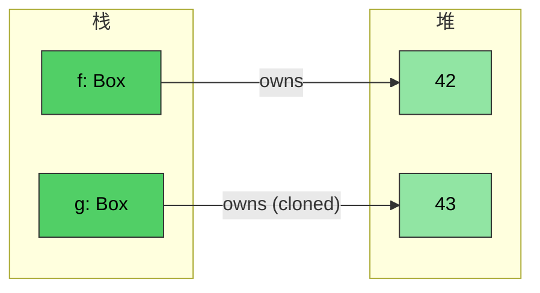
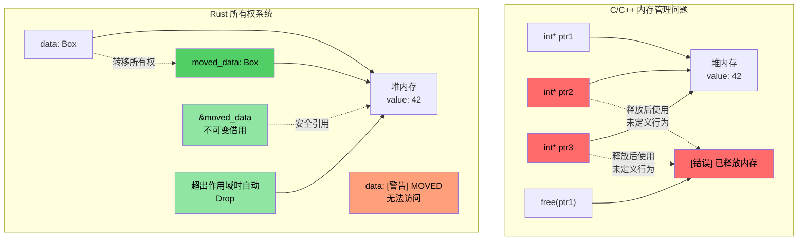
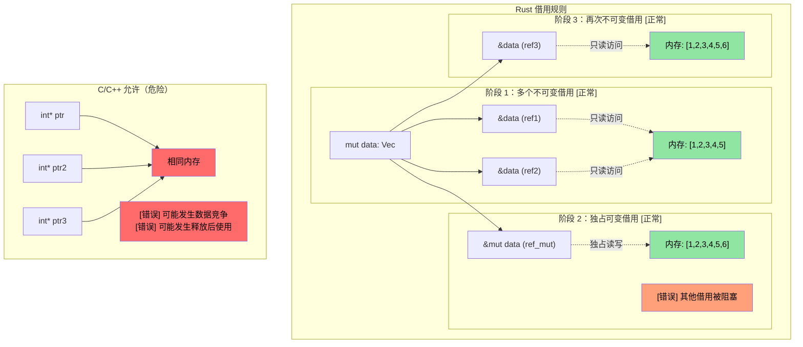

# Rust `Box<T>`

> **你将学到什么：** Rust 的智能指针类型 —— 用于堆分配的 `Box<T>`、用于共享所有权的 `Rc<T>`，以及用于内部可变性的 `Cell<T>`/`RefCell<T>`。这些建立在前面几节的所有权和生命周期概念之上。你还将简要了解用于打破引用循环的 `Weak<T>`。

**为什么用 `Box<T>`？** 在 C 中，你使用 `malloc`/`free` 进行堆分配。在 C++ 中，`std::unique_ptr<T>` 包装 `new`/`delete`。Rust 的 `Box<T>` 是等效的 —— 一个堆分配的、单一所有者的指针，在超出作用域时自动释放。与 `malloc` 不同，没有需要忘记的匹配 `free`。与 `unique_ptr` 不同，没有 use-after-move —— 编译器完全阻止它。

**何时使用 `Box` vs 栈分配：**
- 包含类型很大，你不想在栈上拷贝它
- 你需要递归类型（例如，包含自身的链表节点）
- 你需要 trait 对象（`Box<dyn Trait>`）

- `Box<T>` 可用于创建指向堆分配类型的指针。无论 `\u003cT\u003e` 的类型如何，指针始终是固定大小
```rust
fn main() {
    // 创建一个指向整数（值为 42）的指针，在堆上创建
    let f = Box::new(42);
    println!("{} {}", *f, f);
    // 克隆 box 创建新的堆分配
    let mut g = f.clone();
    *g = 43;
    println!("{f} {g}");
    // g 和 f 在这里离开作用域并自动释放
}
```


## 所有权与借用可视化

### C/C++ vs Rust：指针与所有权管理

```c
// C - 手动内存管理，潜在问题
void c_pointer_problems() {
    int* ptr1 = malloc(sizeof(int));
    *ptr1 = 42;
    
    int* ptr2 = ptr1;  // 都指向同一块内存
    int* ptr3 = ptr1;  // 三个指针指向同一块内存
    
    free(ptr1);        // 释放内存
    
    *ptr2 = 43;        // 释放后使用 - 未定义行为！
    *ptr3 = 44;        // 释放后使用 - 未定义行为！
}
```

> **面向 C++ 开发者：** 智能指针有帮助，但不能防止所有问题：
>
> ```cpp
> // C++ - 智能指针有帮助，但不能防止所有问题
> void cpp_pointer_issues() {
>     auto ptr1 = std::make_unique<int>(42);
>     
>     // auto ptr2 = ptr1;  // 编译错误：unique_ptr 不可拷贝
>     auto ptr2 = std::move(ptr1);  // 正常：所有权转移
>     
003e     // 但 C++ 仍然允许 use-after-move：
>     // std::cout << *ptr1;  // 编译！但未定义行为！
>     
>     // shared_ptr 别名：
>     auto shared1 = std::make_shared<int>(42);
>     auto shared2 = shared1;  // 都拥有数据
>     // 谁"真正"拥有它？都不是。到处都是引用计数开销。
> }
> ```

```rust
// Rust - 所有权系统防止这些问题
fn rust_ownership_safety() {
    let data = Box::new(42);  // data 拥有堆分配
    
    let moved_data = data;    // 所有权转移给 moved_data
    // data 不再可访问 - 如果使用则编译错误
    
    let borrowed = &moved_data;  // 不可变借用
    println!("{}", borrowed);    // 安全使用
    
    // moved_data 在超出作用域时自动释放
}
```



### 借用规则可视化

```rust
fn borrowing_rules_example() {
    let mut data = vec![1, 2, 3, 4, 5];
    
    // 多个不可变借用 - 正常
    let ref1 = &data;
    let ref2 = &data;
    println!("{:?} {:?}", ref1, ref2);  // 都可以使用
    
    // 可变借用 - 独占访问
    let ref_mut = &mut data;
    ref_mut.push(6);
    // ref1 和 ref2 在 ref_mut 活动期间不能使用
    
    // ref_mut 完成后，不可变借用再次有效
    let ref3 = &data;
    println!("{:?}", ref3);
}
```



---

## 内部可变性：`Cell<T>` 和 `RefCell<T>`

回想一下，Rust 中变量默认不可变。有时希望类型的绝大部分是只读的，同时允许对单个字段进行写访问。

```rust
struct Employee {
    employee_id : u64,   // 这必须是不可变的
    on_vacation: bool,   // 如果我们想允许对这个字段进行写访问，但确保 employee_id 不能被变异会怎样？
}
```

- 回想一下，Rust 允许对变量的 *单一可变* 引用和任意数量的 *不可变* 引用 —— 在 *编译时* 强制执行
- 如果我们想传递一个 *不可变* 的员工向量，*但* 允许更新 `on_vacation` 字段，同时确保 `employee_id` 不能被变异会怎样？

### `Cell<T>` —— Copy 类型的内部可变性

- `Cell<T>` 提供 **内部可变性**，即对否则只读的引用的特定元素进行写访问
- 通过拷贝值进出工作（需要 `T: Copy` 才能使用 `.get()`）

### `RefCell<T>` —— 带运行时借用检查的内部可变性

- `RefCell<T>` 提供一种适用于引用的变体
    - 在 **运行时** 而不是编译时强制执行 Rust 借用检查
    - 允许单一 *可变* 借用，但如果还有其他未完成引用则 **panic**
    - 使用 `.borrow()` 进行不可变访问，使用 `.borrow_mut()` 进行可变访问

### 何时选择 `Cell` vs `RefCell`

| 标准 | `Cell<T>` | `RefCell<T>` |
|-----------|-----------|-------------|
| 适用于 | `Copy` 类型（整数、布尔值、浮点数） | 任何类型（`String`、`Vec`、结构体） |
| 访问模式 | 拷贝值进出（`.get()`、`.set()`） | 就地借用（`.borrow()`、`.borrow_mut()`） |
| 失败模式 | 不会失败 —— 没有运行时检查 | **Panic** 如果在另一个借用活动时进行可变借用 |
| 开销 | 零 —— 只是拷贝字节 | 小 —— 在运行时跟踪借用状态 |
| 何时使用 | 你需要在不可变结构内的可变标志、计数器或小值 | 你需要在不可变结构内变异 `String`、`Vec` 或复杂类型 |

---

## 共享所有权：`Rc<T>`

`Rc<T>` 允许对 *不可变* 数据的引用计数共享所有权。如果我们想在多个地方存储相同的 `Employee` 而不拷贝会怎样？

```rust
#[derive(Debug)]
struct Employee {
    employee_id: u64,
}
fn main() {
    let mut us_employees = vec![];
    let mut all_global_employees = Vec::<Employee>::new();
    let employee = Employee { employee_id: 42 };
    us_employees.push(employee);
    // 不会编译 —— employee 已经被移动
    //all_global_employees.push(employee);
}
```

`Rc<T>` 通过允许共享 *不可变* 访问来解决这个问题：
- 包含类型自动解引用
- 当引用计数达到 0 时类型被 drop

```rust
use std::rc::Rc;
#[derive(Debug)]
struct Employee {employee_id: u64}
fn main() {
    let mut us_employees = vec![];
    let mut all_global_employees = vec![];
    let employee = Employee { employee_id: 42 };
    let employee_rc = Rc::new(employee);
    us_employees.push(employee_rc.clone());
    all_global_employees.push(employee_rc.clone());
    let employee_one = all_global_employees.get(0); // 共享不可变引用
    for e in us_employees {
        println!("{}", e.employee_id);  // 共享不可变引用
    }
    println!("{employee_one:?}");
}
```

> **面向 C++ 开发者：智能指针对照**
>
> | C++ 智能指针 | Rust 等效 | 关键区别 |
> |---|---|---|
> | `std::unique_ptr<T>` | `Box<T>` | Rust 版本是默认的 —— 移动是语言级别的，不是可选的 |
> | `std::shared_ptr<T>` | `Rc<T>`（单线程）/ `Arc<T>`（多线程） | `Rc` 没有原子开销；只在跨线程共享时使用 `Arc` |
> | `std::weak_ptr<T>` | `Weak<T>`（来自 `Rc::downgrade()` 或 `Arc::downgrade()`） | 相同目的：打破引用循环 |
>
> **关键区别**：在 C++ 中，你 *选择* 使用智能指针。在 Rust 中，拥有值（`T`）和借用（`&T`）涵盖大多数用例 —— 只在需要堆分配或共享所有权时才使用 `Box`/`Rc`/`Arc`。

### 用 `Weak<T>` 打破引用循环

`Rc<T>` 使用引用计数 —— 如果两个 `Rc` 值相互指向，则都不会被 drop（循环）。`Weak<T>` 解决这个问题：

```rust
use std::rc::{Rc, Weak};

struct Node {
    value: i32,
    parent: Option<Weak<Node>>,  // 弱引用 —— 不阻止 drop
}

fn main() {
    let parent = Rc::new(Node { value: 1, parent: None });
    let child = Rc::new(Node {
        value: 2,
        parent: Some(Rc::downgrade(&parent)),  // 弱引用指向父节点
    });

    // 使用 Weak 时，尝试升级 —— 返回 Option<Rc<T>>
    if let Some(parent_rc) = child.parent.as_ref().unwrap().upgrade() {
        println!("Parent value: {}", parent_rc.value);
    }
    println!("Parent strong count: {}", Rc::strong_count(&parent)); // 1, 不是 2
}
```

> `Weak<T>` 在 [避免过度 clone()](ch17-1-avoiding-excessive-clone.md) 中有更深入的讲解。目前，关键要点是：**对树/图结构中的"反向引用"使用 `Weak` 以避免内存泄漏。**

---

## 结合 `Rc` 与内部可变性

当你组合 `Rc<T>`（共享所有权）与 `Cell<T>` 或 `RefCell<T>`（内部可变性）时，真正的力量就显现出来了。这让多个所有者 **读写** 共享数据：

| 模式 | 用例 |
|---------|----------|
| `Rc<RefCell<T>>` | 共享、可变数据（单线程） |
| `Arc<Mutex<T>>` | 共享、可变数据（多线程 —— 参见 [ch13](ch13-concurrency.md)） |
| `Rc<Cell<T>>` | 共享、可变 Copy 类型（简单标志、计数器） |

---

# 练习：共享所有权与内部可变性

🟡 **中级**

- **第 1 部分（Rc）**：创建一个 `Employee` 结构体，包含 `employee_id: u64` 和 `name: String`。将它放在 `Rc<Employee>` 中并克隆到两个单独的 `Vec` 中（`us_employees` 和 `global_employees`）。从两个向量打印以显示它们共享相同数据。
- **第 2 部分（Cell）**：给 `Employee` 添加一个 `on_vacation: Cell<bool>` 字段。传递一个不可变的 `\u0026Employee` 引用给函数，并在函数内部切换 `on_vacation` —— 不使引用可变。
- **第 3 部分（RefCell）**：将 `name: String` 替换为 `name: RefCell<String>` 并写一个函数，通过 `\u0026Employee`（不可变引用）给员工名字追加后缀。

**起始代码：**
```rust
use std::cell::{Cell, RefCell};
use std::rc::Rc;

#[derive(Debug)]
struct Employee {
    employee_id: u64,
    name: RefCell<String>,
    on_vacation: Cell<bool>,
}

fn toggle_vacation(emp: &Employee) {
    // TODO: 使用 Cell::set() 翻转 on_vacation
}

fn append_title(emp: &Employee, title: &str) {
    // TODO: 通过 RefCell 可变借用 name 并 push_str 添加 title
}

fn main() {
    // TODO: 创建员工，包装在 Rc 中，克隆到两个 Vec 中，
    // 调用 toggle_vacation 和 append_title，打印结果
}
```

<details><summary>解答（点击展开）</summary>

```rust
use std::cell::{Cell, RefCell};
use std::rc::Rc;

#[derive(Debug)]
struct Employee {
    employee_id: u64,
    name: RefCell<String>,
    on_vacation: Cell<bool>,
}

fn toggle_vacation(emp: &Employee) {
    emp.on_vacation.set(!emp.on_vacation.get());
}

fn append_title(emp: &Employee, title: &str) {
    emp.name.borrow_mut().push_str(title);
}

fn main() {
    let emp = Rc::new(Employee {
        employee_id: 42,
        name: RefCell::new("Alice".to_string()),
        on_vacation: Cell::new(false),
    });

    let mut us_employees = vec![];
    let mut global_employees = vec![];
    us_employees.push(Rc::clone(&emp));
    global_employees.push(Rc::clone(&emp));

    // 通过不可变引用切换休假状态
    toggle_vacation(&emp);
    println!("On vacation: {}", emp.on_vacation.get()); // true

    // 通过不可变引用追加头衔
    append_title(&emp, ", Sr. Engineer");
    println!("Name: {}", emp.name.borrow()); // "Alice, Sr. Engineer"

    // 两个 Vec 看到相同的数据（Rc 共享所有权）
    println!("US: {:?}", us_employees[0].name.borrow());
    println!("Global: {:?}", global_employees[0].name.borrow());
    println!("Rc strong count: {}", Rc::strong_count(&emp));
}
// 输出：
// On vacation: true
// Name: Alice, Sr. Engineer
// US: "Alice, Sr. Engineer"
// Global: "Alice, Sr. Engineer"
// Rc strong count: 3
```

</details>
